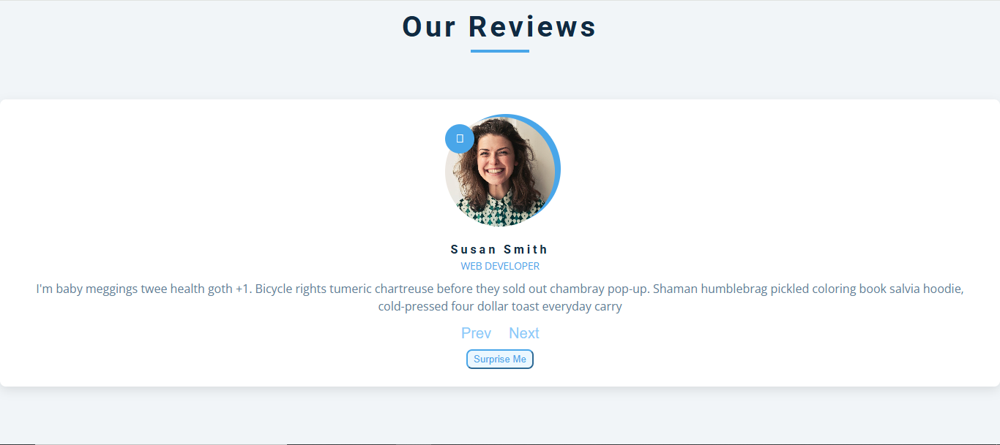

# ⭐ Reviews Project

A simple and responsive **Reviews App** built with **HTML**, **CSS**, and **JavaScript**.  
It displays customer reviews with next/previous navigation and a random review button.

---

## 📋 Features

✅ Display a list of reviews (name, job, photo, and text)  
✅ Navigate through reviews with **Prev** and **Next** buttons  
✅ Display a **random review** on button click  
✅ Responsive and clean design  
✅ Local image and external image support

---

## 🖼️ Screenshot

---

## 🚀 Technologies Used

- HTML5
- CSS3
- Vanilla JavaScript

---

## 📂 Project Structure

- index.html — Main HTML file

- style.css — Stylesheet

- script.js — JavaScript logic

- INV-A0001-PIC3.png — Local image file

---

## 🧑‍💻 How It Works

- The HTML contains a static structure with placeholders for the review.
- On page load, JavaScript replaces the placeholder content with the first review from the `reviews` array.
- The **Next** and **Prev** buttons cycle through the list of reviews.
- The **Surprise Me** button shows a random review.

---

## 🔧 Setup & Run Locally

1️⃣ Clone the repository or download the files.  
2️⃣ Make sure all files (`index.html`, `style.css`, `script.js`, and `INV-A0001-PIC3.png`) are in the same folder.  
3️⃣ Open `index.html` in your browser.  

---

⭐ Enjoy!
